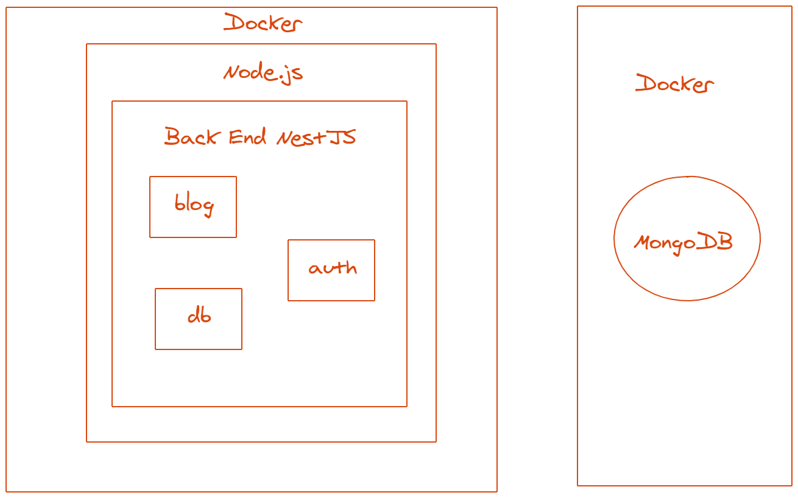

## Blog REST APİ

### Açıklama

```
Blog yapısında login ve makaleler yayınlanacak api sistemi.
```

## Kurulum

```
#Env

MONGODB_CONNECTION_STRING=
MONGODB_DATABASE=pets-db

# development

$ npm run start

```

## Mimari

\


## Link

```

```

## Teknoloji

```

Node
NestJS
MongoDB

```
